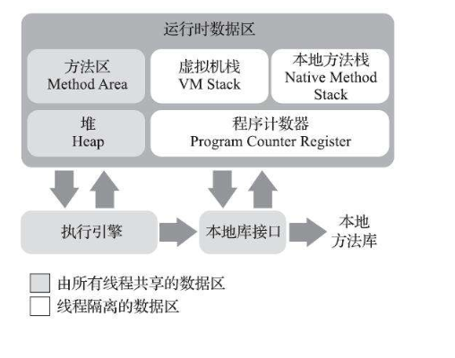
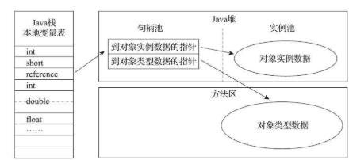
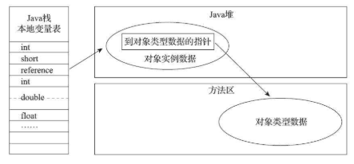
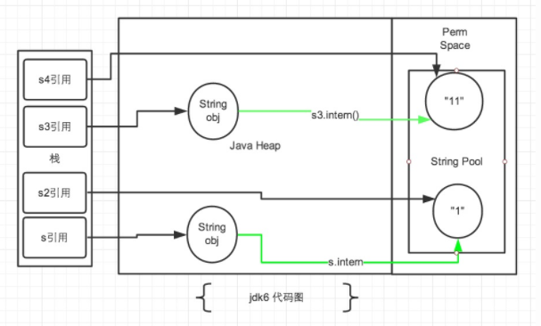
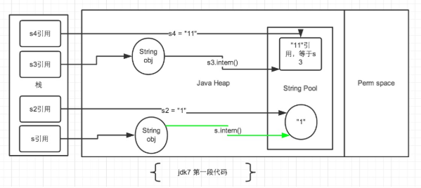

> 在万变的技术浪潮中找到不变的东西才是最重要的.

> 《深入理解 Java 虚拟机 - 第三版》已于近日出版, 第三版在编撰期间 Java 已经发展到了 JDK 13. 此书相对于第二版, 讲到的技术更加与时
> 俱进, 内容更加全面丰富, 且对上一版部分描述不清的地方进行了补充说明, 值得一读.

### 一. Java 运行时数据区域:



#### 1. 程序计数器(Program Counter Register)

**程序计数器**是当前线程执行字节码的行号指示器, 通过改变计数器的值来确定下一条指令的地址, 通过改变此值可以完成循环, 分支, 跳转, 
异常处理, 线程切换等.

以多线程为例, Java 虚拟机的多线程通过线程轮流切换, 分配 CPU 执行时间片的方式来实现. 在宏观上讲程序是并行执行的, 但在微观上: 
某一时刻`t`, 一个处理器会执行一条指令. 因此, 为了线程恢复之后能够找到正确的执行位置, 每条线程都需要一个单独(或者私有)的计数器.

> 若线程执行的是 Java 方法, 则计数器保存的是正在执行的字节码指令的地址; 如果执行 `Native` 方法, 则此值为 `Undefined`.

#### 2. Java 虚拟机栈(Java Virtual Machine Stack)

虚拟机栈描述的是 Java 方法执行的线程内存模型, 每个方法被调用执行时, 会同步创建一个**栈帧**, 存储**局部变量表, 操作数栈, 动态链接, 
方法出口等.** 每个方法的执行到结束, 都会对应入栈 - 出栈的过程.

局部变量表存放**编译期已知**的基本数据类型(int, long, double, short, boolean, char, float, byte), 对象引用(reference), 
returnAddress(指向字节码指令的地址). 其生命周期与线程相同.

#### 3. 本地方法栈(Native Method Stacks)

与虚拟机栈作用相似, 为虚拟机执行 `Native` 方法服务.

在 `Hotspot` 虚拟机中并没有区分虚拟机栈和本地方法栈. 本地方法栈参数: `-Xoss` 即使配置了也不会生效.

#### 4. 堆(Heap)

堆是所有线程共享的区域, 在虚拟机启动时创建, 存放对象实例(实际上并非所有对象都存储在堆中, 例如 JIT 技术: 逃逸分析, 栈上分配, 标量替换等
优化手段下, 对象并非存储到堆).

Java 堆在逻辑上是连续的, 但物理上可以处于不连续的空间. 不过若涉及到大对象(数组), 并考虑到简单高效, 可能会要求连续的内存空间.

#### 5. 方法区(Method Area)

方法区对于所有线程共享, 存储虚拟机加载的类型信息, 常量, 静态变量, 即时编译后的代码缓存数据等.

提到方法区就会想到 `JDK 8` 以前的**永久代**, Hotspot 虚拟机设计团队为了省略方法区的内存管理工作, 便把虚拟机的分代设计扩展到方法区, 
使其可以像堆一样管理此部分内存.
现在看来, 用"永久代"的思路实现方法区的设计, 更容易导致内存溢出的问题.
1. 方法区的垃圾回收主要是针对常量池和类型的卸载, 但条件较苛刻, 回收效果欠佳;
2. 另外, 自 2008 年 `Oracle` 收购 `BEA` 公司后, 准备将 `BEA` 公司的 `JRockit` 虚拟机 `Java Mission Control` 等优秀特性移植
到 `Hotspot`, 但 `JRockit` 并没有方法区的概念, 给两者的融合带来了不少问题.

综上考虑, `Hotspot` 虚拟机决定将"永久代"废弃掉. 自 `JDK 7` 原本存储在方法区的: 字符串常量池, 类型信息, 静态变量等移动到了堆空间, 
到了 `JDK 8` 则完全废弃了"永久代", 改用本地内存来实现. 因此方法区容量指定参数: `-XX: MaxPermSize` 在已经 JDK 8 就已失效了, 可以
使用 `-XX: MaxMeta-spaceSzie` 参数指定元空间容量大小.

> 运行时常量池是方法区的一部分(自 JDK 8 运行时常量池已被移动到堆区), 存放编译期间生成的**字面量和符号引用**, 运行时新的常量也会进入
> 常量池. 

##### 直接内存

直接内存并不属于虚拟机数据区, 但也会被频繁使用到. `JDK 1.4` 加入的 `NIO` 使用一种基于`通道(Channel)`和`缓冲区(Buffer)`的 `I/O` 
方式, 可以使用 `Native` 函数直接分配对外内存, 使用 `DirectByteBuffer` 对象作为这块内存的引用进行操作, 可以避免 `Java` 堆
和 `Native` 堆之间复制数据, 提高性能.

### 二. 对象的存储结构

#### 1. 对象的创建

创建一个对象, 除了使用 `new` 关键字, 还有很多手段: 复制, 反序列化, 反射等. 以 `new` 关键字为例: 

1. 首先会检查该指令的参数能否在常量池定位到类的符号引用, 并检查此符号引用是否被加载, 解析, 初始化, 若没有需执行类加载; 
2. 通过检查后为对象分配内存, 即在堆中分出一部分空间存储实例;
3. 将内存空间初始化为0(不包括对象头);
4. 填充对象头(Object Header)信息: 类的元数据, hashCode, GC 年龄, 类型指针(属于哪个对象), 锁状态等;
5. 执行自定义构造方法.

在这过程中需要关注几点.

##### 内存分配

关于内存分配, 目前有两种方式:
1. 假如堆是内存规整的, 被占用的内存放一边, 空闲内存放一边, 中间有指针分界, 那么此时只需要将指针向空闲内存方向移动一定大小即可.
这种分配办法称为: **指针碰撞**
2. 若内存不是规整的, 则不能简单地使用指针碰撞了, 需要维护一个列表: 用于记录哪些内存被占用, 哪些是空闲的. 从表中筛选出可供对象存储的
内存. 这种办法称为: **空闲列表**
    
由此可见, 使用哪种方式分配取决于堆内存是否规整, 堆内存规整与否则由"空间压缩(Compact)"特性有关. `Serial`, `ParNew` 等收集器支持
压缩整理, 使用指针碰撞简单又高效; `CMS` 收集器基于清除算法, 理论上只能使用空闲列表来分配(实际上为了提高性能做了一些优化, 例如通过
空闲列表的方式拿到一大块内存, 在此块内存中则使用指针碰撞的方式分配).

##### 并发性

对象创建是非常频繁的行为, 即使只修改指针的指向, 放在并发环境下也不安全, 为了解决此问题, 有两种办法:

1. "CAS + 重试" 可以保证操作的原子性, 原理是用到了 CPU `cmpxchg` 指令;
2. 为每个线程在堆中分配一块内存, 称为本地线程分配缓冲区(`Thread Local Allocation Buffer`, TLAB), 哪个线程分配内存, 则在哪个缓冲区
分配. 可以降低并发导致的资源冲突.

#### 2. 对象的内存布局

**对象的存储结构包括三部分: 对象头(Object Header), 实例数据(Instance Data), 对齐填充(Pdding)**.

##### 对象头

对象头一般包含两部分信息:
1. 对象自身的运行时数据: `hashCode`, GC 分代年龄, 锁标志, 偏向线程 ID 等, 这部分称为: **MarkWord**. `MarkWord` 为了实现以极小的
内存存储更多的信息, 使用了动态定义的数据结构:

|               存储内容               | 标志位 |    状态    |
| :----------------------------------: | :----: | :--------: |
|        hashCode, 对象分代年龄        |   01   |   未锁定   |
|           指向锁记录的指针           |   00   | 轻量级锁定 |
|          指向重量级锁的指针          |   10   | 重量级锁定 |
|            空, 不记录信息            |   11   |  GC 标记   |
| 偏向线程ID, 偏向时间戳, 对象分代年龄 |   01   |   可偏向   |

2.类型指针

通过类型指针, 可以知道对象是哪个类的实例.

##### 实例数据

存储类中定义的字段内容. `Hotspot` 默认的分配顺序为: `longs / doubles, ints, shorts / chars, bytes / booleans, 
oops(Oridinary Object Pointers)`, 相同长度的字段被分配到一起存放(节省内存). 
如果开启了 `+XX: CompactFields=true`, 那么子类中较窄的变量会插入到父类变量的空隙中.

##### 填充

`Hotspot` 内存管理要求对象的起始地址必须为 `8byte` 的整数倍, 如果有空隙的话就需要补全.

#### 3. 对象的访问定位

对象的访问定位一般有两种办法:
1. 句柄: `Java` 堆划分出一块内存作为句柄池, `reference` 指向句柄的地址, 句柄中包含: `对象实例数据`和`类型数据`; `reference` 的
指向是稳定的, 对象被移动(经过 GC 的整理过程)的话, 只需改动句柄的实例数据指针.



2. 直接指针: `reference` 指向的是实际数据的存储地址; (速度快, 无需二次定位, 虚拟机中对象的访问很频繁, 使用直接指针可以节省不少时间)



对于 `Hotspot` 主要使用了直接指针的办法定位对象.

### 三. 补充

1. 内存溢出 & 内存泄漏
* 内存溢出(OOM): 程序在申请内存时, 已没有足够的空间分配, 抛出错误即为内存溢出;
* 内存泄漏: 内存泄漏是指本应该回收的对象, 由于某些原因没有回收或者回收失败了. 内存泄漏次数太多, 可分配空间越小, 久而久之必然会发生
内存溢出.

2. 关于 `String#intern()`

该方法的作用: 返回字符串在常量池中的引用; 若常量池中不存在, 则将字符串加入到常量池中, 再返回对应的引用. 

有很多面试题会问: `String s = new String("abc")` 创建了几个对象的题目, 主要考察的就是字符串常量池的掌握程度.

##### 第一段代码

```java
public class Test {

    public static void main(String[] args) {
        String s = new String("1");
        s.intern();
        String s2 = "1";
        System.out.println(s == s2);
    
        String s3 = new String("1") + new String("1");
        s3.intern();
        String s4 = "11";
        System.out.println(s3 == s4);
    }

}
```



解释: `JDK 6` 及以前常量池存储在方法区中, 方法区与堆区是完全分开的. `intern()` 方法返回的是字符串常量池中的引用, 而 `StringBuilder`
生成的对象在堆区, 拿堆区的对象地址和字符串常量池中的对象地址比较, 结果是不同的. 输出为: `false false`



解释: 首先看 s3 字符串 `String s3 = new String("1") + new String("1")` 生成了 2 个最终对象, 即字符串常量池中的 "1" 和堆区的
 `s3` 指向的对象"11"(中间两个匿名的 `new String()` 暂不讨论), 但常量池中是不存在 "11" 字符串的.
 
接下来执行 String.intern() 方法, **需注意的是: 字符串常量池已不在方法区了, 而在堆区.** 那么此时常量池不需要再存储一份 "11" 了, 直接
存储堆中的引用, 将这份引用指向 `s3` 引用的对象. 即引用是相同的.

最后 `String s4 = "11"` 显式声明, 直接向常量池中创建, 但由于常量池已有此对象了, 此时也会指向 s3 对象的引用. 因此 s3 和 s4 指向是
同样的. `s3 == s4 -> true`


##### 第二段代码

### 参考

1. 《深入理解 Java 虚拟机》
2. [深入解析String#intern](https://tech.meituan.com/2014/03/06/in-depth-understanding-string-intern.html)